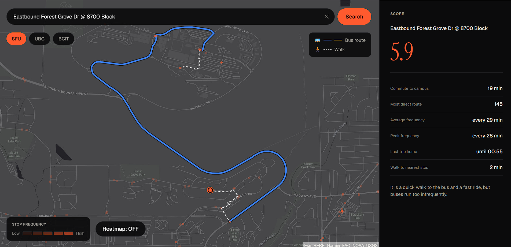

# Headway: Transit Housing Scorer

Search an address. Know the transit.

A neighbourhood transit scorer for students hunting off-campus housing. Get a 0-10 score based on commute time, bus frequency, late-night service, and walk distance to campus — backed by real TransLink GTFS data, not estimates.



**Live:** [www.headwayhome.tech](https://www.headwayhome.tech/app) (custom domain) · also at [headway-frontend-production.up.railway.app](https://headway-frontend-production.up.railway.app/app) — backend API at [headway-backend-production-582c.up.railway.app/docs](https://headway-backend-production-582c.up.railway.app/docs)

---

## What it does

1. Search an address, or click any real transit stop on the map.
2. Headway scores it 0–10 from real GTFS data: commute time, bus frequency, late-night service, and walk distance to the nearest stop.
3. See the breakdown, not just the number — each factor shows its own value, plus a plain-English verdict explaining why it scored that way.
4. The actual route draws on the map: colored bus segments, dashed walking segments, auto-zoomed to fit the journey.

## Sustainability

Housing choice is one of the biggest levers on a student's carbon footprint — and it's usually decided before anyone thinks about transit at all. A cheaper apartment three blocks from the nearest infrequent bus quietly locks someone into years of driving or ride-hailing. A slightly pricier one two minutes from a frequent line doesn't. Most listings don't tell you which one you're looking at. Headway does, in one number.

This is a direct fit for **UN Sustainable Development Goal 11** (Sustainable Cities and Communities) — specifically target 11.2, access to safe, affordable, and sustainable transport systems. Every search is a small nudge toward transit-first housing decisions instead of car-first ones, and that compounds across however many students end up using it before signing a lease.

We also didn't want a tool that only tells people what they want to hear. One real address near SFU scores **5.9/10** — not because it's badly located (19-minute commute, a 2-minute walk to the nearest stop) but because service there only runs every 28–29 minutes. Headway says so plainly: *"It is a quick walk to the bus and a fast ride, but buses run too infrequently."* That kind of specific, honest feedback is what makes the score trustworthy instead of just another marketing number — and it's the same kind of address-level detail that could back up a real conversation with TransLink about where student-heavy neighbourhoods are actually underserved.

## Known Limitations

Scope was tight for a 24-hour build, so a few things are rough edges rather than missing entirely:

- **Heatmap** uses a server-computed score grid (no H3 — it fails to build on Windows via CMake, so we avoided it entirely) rather than the originally planned hex-grid approach. Water is excluded using a "is there a real transit stop within 1.5km" heuristic instead of a land-mask dataset (the first version used `global_land_mask`, which OOM-killed the backend on Railway's free tier — swapped for a zero-memory-footprint check reusing data already in memory). Very remote land with no nearby stops at all will read as excluded too, which is an acceptable trade for actually working in production.
- **Geocoding** is bounded to Metro Vancouver by design — addresses outside the region correctly return "not found" rather than a wrong answer.
- Full reasoning and the scope-cut log: [`headway-claude.md`](headway-claude.md).

---

## Setup

### Backend
```bash
cd backend
python3 -m venv venv
source venv/bin/activate
pip install -r requirements.txt
cp .env.example .env   # add a GEMINI_API_KEY for the plain-language verdict (optional)
python main.py
```

**API Docs:** http://localhost:8000/docs

### Frontend
```bash
cd frontend
npm install
npm run dev
```

**App:** http://localhost:5173/app

---

## API

| Endpoint | Method | Description |
|---|---|---|
| `/api/score` | POST | `{address, campus, lat?, lon?}` → score + factors. Pass `lat`/`lon` directly to skip geocoding (used when selecting a map stop). |
| `/api/summary` | POST | `{score, factors, campus}` → one-line plain-English verdict (Gemini). Fetched separately so the score never waits on it. |
| `/api/route` | GET | `?lat=&lon=&campus=` → GeoJSON route (ride + walk segments) for the map. |
| `/api/heatmap` | GET | `?campus=` → scored grid GeoJSON for the heatmap toggle. |
| `/api/health` | GET | Health check. |

Full interactive docs at `/docs` once the backend is running (FastAPI auto-generated Swagger UI).

---

## Tech Stack

- **Backend:** FastAPI, Python 3.11, real TransLink GTFS data, Gemini API (verdict generation)
- **Frontend:** React, Vite, React Router, MapLibre GL (map, route lines, heatmap), Tailwind CSS
- **Geocoding:** Nominatim, bounded to Metro Vancouver
- **Deployment:** Railway, custom domain via a free MLH `.tech` domain (both backend and frontend as separate services)

---

## Roles


- **BE1:** Scoring & geospatial logic
- **BE2:** GTFS data pipeline
- **FE:** Map UI & React components
- **GEN:** Landing page, QA, demo

See [`headway-claude.md`](headway-claude.md) for the full project spec.
