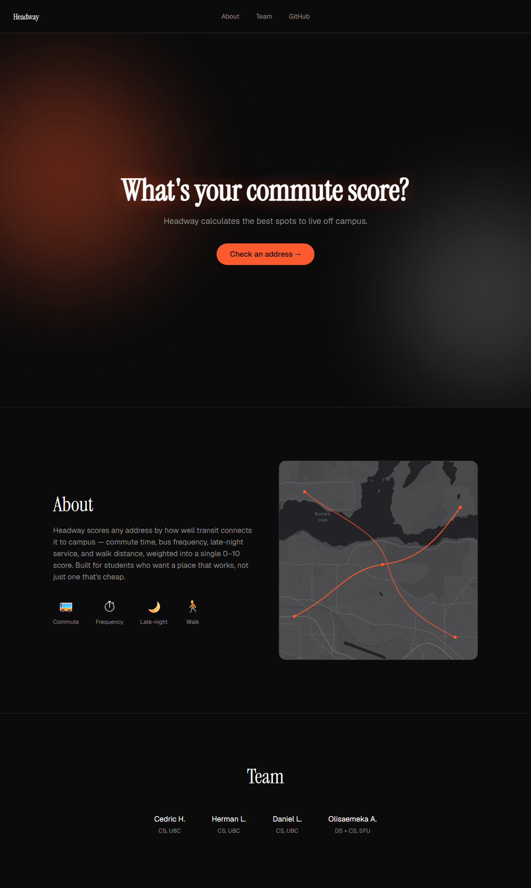

# Headway: Transit Housing Scorer

Search an address. Know the transit.

A neighbourhood transit scorer for students hunting off-campus housing. Get a 0-10 score based on commute time, bus frequency, late-night service, and walk distance to campus.



**Live:** not deployed yet — Railway deployment is planned but hasn't happened. Run it locally for now (see Setup below).

---

## What it does

1. Enter an address (or pick a spot on the map, once that's live).
2. Headway scores it 0–10 based on four weighted factors: commute time, bus frequency, late-night service, and walk distance to the nearest stop.
3. See the breakdown, not just the number — each factor shows its own value and contribution.

## Known Limitations

**Heatmap is cut from scope.** The H3 library fails to build on Windows (CMake toolchain issue), and we pulled it from `requirements.txt` rather than burn hours fighting it. The core product — search an address, get a score + 4 factors — doesn't depend on it. See [`headway-claude.md`](headway-claude.md) for the full reasoning and the scope-cut log.

---

## Setup

### Backend
```bash
cd backend
python3 -m venv venv
source venv/bin/activate
pip install -r requirements.txt
cp .env.example .env
python main.py
```

**API Docs:** http://localhost:8000/docs

### Frontend
```bash
cd frontend
npm install
npm run dev
```

**App:** http://localhost:5175 (or whatever port Vite picks)

---

## API

| Endpoint | Method | Description |
|---|---|---|
| `/api/score` | POST | `{address, campus}` → `{score, factors}` |
| `/api/health` | GET | Health check |

Full interactive docs at `/docs` once the backend is running (FastAPI auto-generated Swagger UI).

---

## Tech Stack

- **Backend:** FastAPI, Python 3.11, ~~H3~~ (cut — Windows build issue), GTFS data
- **Frontend:** React, Vite, React Router, MapLibre GL, Tailwind CSS
- **Deployment:** Railway (planned, not yet live)

---

## Roles

- **BE1:** Scoring & geospatial logic
- **BE2:** GTFS data pipeline
- **FE:** Map UI & React components
- **GEN:** Landing page, QA, demo

See [`headway-claude.md`](headway-claude.md) for the full project spec.
